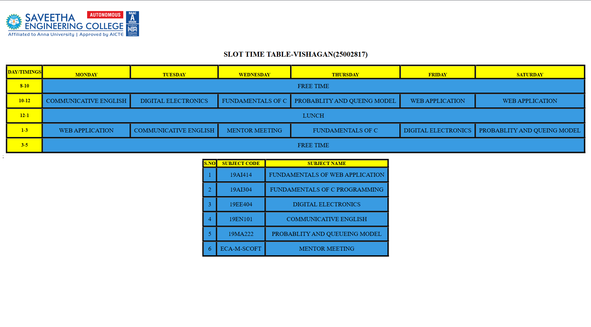

# Ex03 Time Table
## Date: 26-09-2025

## AIM
To write a html webpage page to display your slot timetable.

## ALGORITHM
### STEP 1
Create a Django-admin Interface.

### STEP 2
Create a static folder and inert HTML code.

### STEP 3
Create a simple table using ```<table>``` tag in html.

### STEP 4
Add header row using ```<th>``` tag.

### STEP 5
Add your timetable using ```<td>``` tag.

### STEP 6
Execute the program using runserver command.

## PROGRAM
```html

<!DOCTYPE html>
<html lang="en">
<head>
    <meta charset="UTF-8">
    <meta name="viewport" content="width=device-width, initial-scale=1.0">
    <title>TIME TABLE</title>
    <style>
        table,th,td{
            border: 5px black;
            border-style: groove;
            border-collapse:collapse;
            text-size-adjust: 10px;
            margin: auto;}
            th{
                background-color: yellow;
            }
            td{
                background-color: #399be2;
                padding: 10px;
                font-size: 20px;
            }
    </style>
</head>
<body>
    <table style="text-align: center;">
        
        <h1></h1>
    <h2 style="text-align: center;">SLOT TIME TABLE-VISHAGAN(25002817)</h2>
    <tr style="text-align: center;">
        <th>DAY/TIMINGS</th>
        <th><br>MONDAY</th>
        <th><br>TUESDAY</th>
        <th><br>WEDNESDAY</th>
        <th><br>THURSDAY</th>
        <th><br>FRIDAY</th>
        <th><br>SATURDAY</th>
    </tr>
    <tr style="text-align: center;">
        <th>8-10</th>
        <td colspan="6">FREE TIME</td>
        </tr>
        <tr style="text-align: center;">
            <th>10-12</th>
            <td>COMMUNICATIVE ENGLISH</td>
            <td>DIGITAL ELECTRONICS</td>
            <td>FUNDAMENTALS OF C</td>
            <td>PROBABLITY AND QUEING MODEL</td>
            <td>WEB APPLICATION</td>
            <td>WEB APPLICATION</td>
        </tr>
        <tr style="text-align: center;">
            <th>12-1</th>
            <td colspan="6">LUNCH</td>
        </tr>
        <tr style="text-align: center;">
            <th>1-3</th>
            <td>WEB APPLICATION</td>
            <td>COMMUNICATIVE ENGLISH</td>
            <td>MENTOR MEETING</td>
            <td>FUNDAMENTALS OF C</td>
            <td>DIGITAL ELECTRONICS</td>
            <td>PROBABLITY AND QUEING MODEL</td>
        </tr>
        <tr>
            <th>3-5</th>
            <td colspan="6">FREE TIME</td>
        </tr>
    </table>
    <table style="text-align: center;">
        <tr style="text-align: center;">
            <th> S.NO</th>
            <th>SUBJECT CODE</th>
            <th>SUBJECT NAME</th>
        </tr>
        <tr style="text-align: center;">
            <td>1</td>
            <td>19AI414</td>
            <td>FUNDAMENTALS OF WEB APPLICATION</td>
        </tr>
        <tr style="text-align: center;">
            <td>2</td>
            <td>19AI304</td>
            <td>FUNDAMENTALS OF C PROGRAMMING</td>
        </tr>
        <tr style="text-align: center;">
            <td>3</td>
            <td>19EE404</td>
            <td>DIGITAL ELECTRONICS</td>
        </tr>
        <tr style="text-align: center;">
            <td>4</td>
            <td>19EN101</td>
            <td>COMMUNICATIVE ENGLISH</td>
        </tr>
        <tr style="text-align: center;">
            <td>5</td>
            <td>19MA222</td>
            <td>PROBABLITY AND QUEUEING MODEL</td>
        </tr>
        <tr style="text-align: center;">
            <td>6</td>;
            <td>ECA-M-SCOFT</td>
            <td>MENTOR MEETING</td>
        </tr>
    </table>
    
    
</body>
</html>
```

## OUTPUT


## RESULT
The program for creating slot timetable using basic HTML tags is executed successfully.
